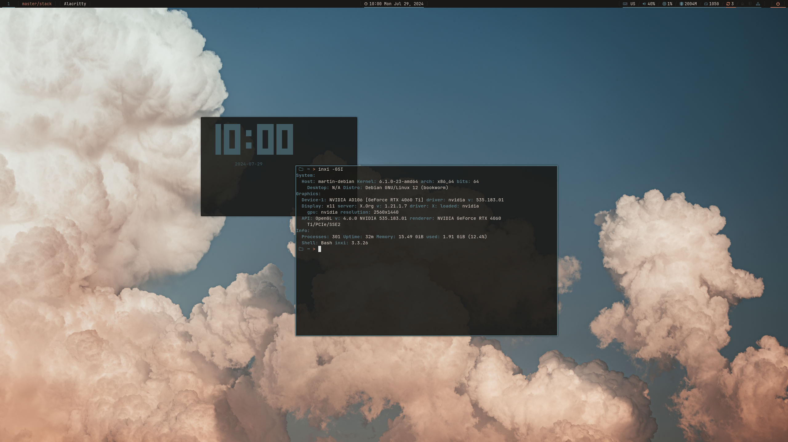
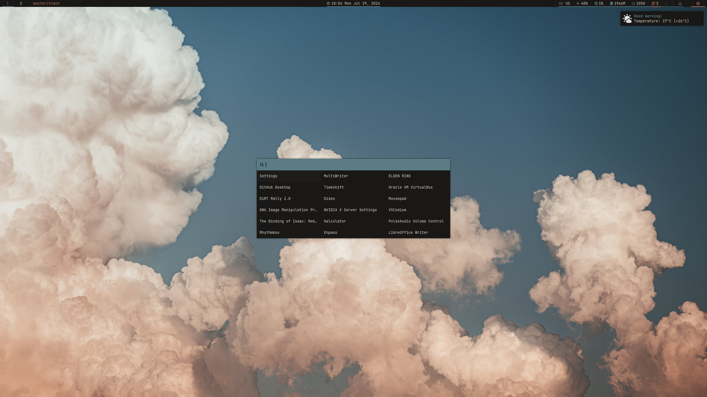

## Description
This repository contains the config files and scripts for my Xmonad window manager configuration on Debian. For installation instructions, go to the bottom of this README file - **do NOT run the `install.sh` script!**
## Screenshots
### Workspace

### Lock screen

## Installation
### Dependencies
Xmonad, xmonad contrib, xmobar, alsa utils, i3lock, maim, xclip, curl, alacritty, rofi, picom, dunst, feh, yaru aqua dark GTK theme (included in `home/.local/share/themes/`), papirus paleorange dark icon theme (included in `home/.local/share/icons`), JetBrains Mono Nerd Font and Ubuntu font (included in `home/.local/share/fonts`).
### Installing the theme
**[!] Do not run the `install.sh` script! It is for my personal use only, it installs programs and system configurations that you probably do not need and that could break your system!**

Copy all files from `home/` to your home directory. Be careful to not overwrite your files if you already have files/folders with the same names as the ones in the repo!
